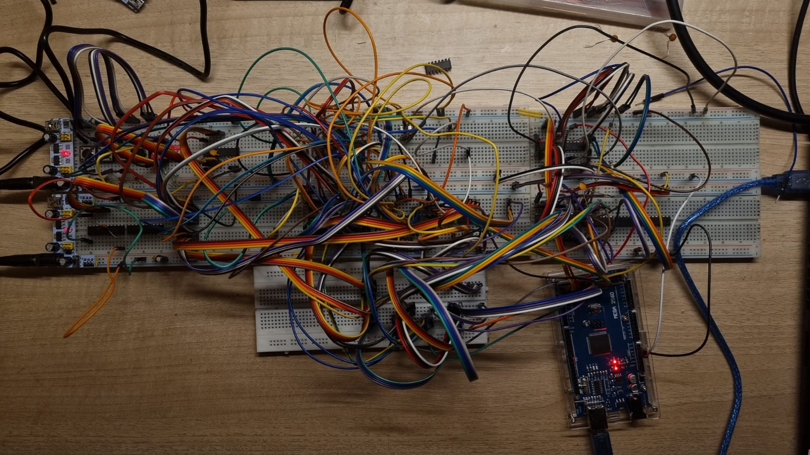
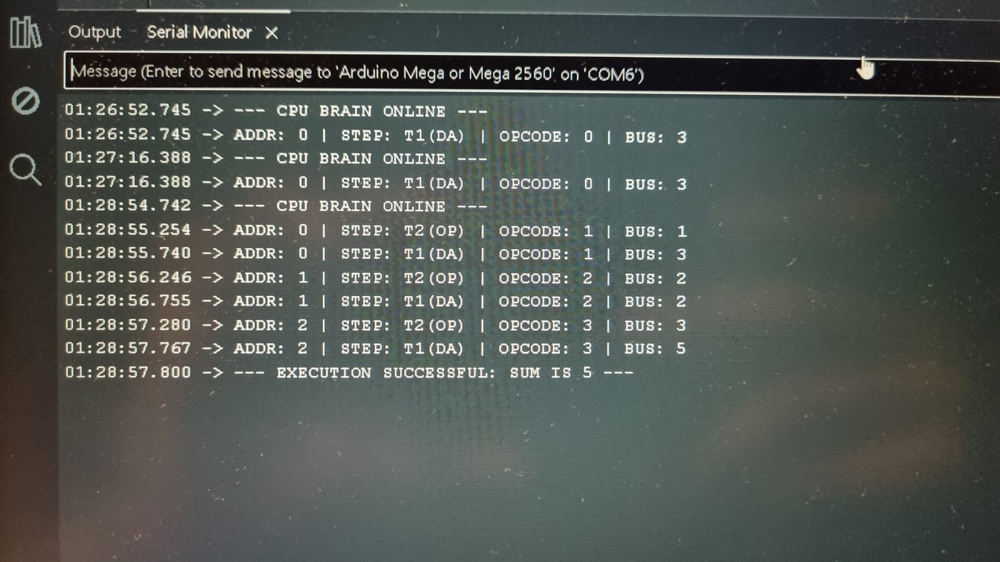
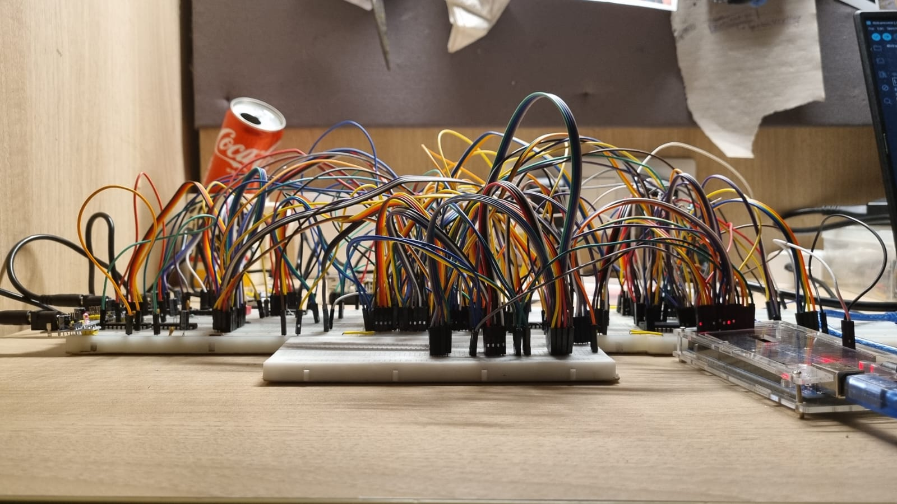
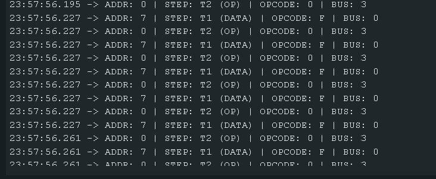
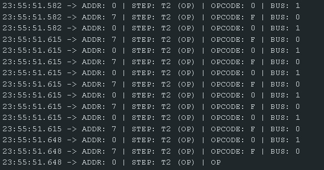

---

# 4-bit TTL Breadboard-based Computer

A fully discrete 4-bit TTL Computer built on breadboards using 74-series logic with Arduino for RAM/ROM emulation

*Figure: The complete 7-breadboard CPU system*

---

## Overview

This project documents the design and construction of a **4-bit, bus-based CPU** built entirely from **74-series TTL logic ICs**, spread across seven full-size breadboards. The goal of this build is not performance or compactness but simply **my own learning**.

### Design Philosophy

The design is inspired by classic educational CPUs (Ben Eater–style, NAND-to-Tetris concepts), but extends them with:

1. A proper **shared data bus** using 74LS245 transceivers
2. A **74LS181 ALU**, enabling both arithmetic and logical operations
3. **Split registers** (low/high nibble) to scale beyond trivial demos
4. Two execution modes:
   - **Manual / Button-Driven Mode** for learning and debugging
   - **Arduino-Driven Mode** where an Arduino acts as ROM, RAM, and instruction sequencer

---

## What this CPU is (and isn't)

### ✅ This CPU is:
- Fully synchronous, TTL-based, and breadboarded
- Designed for learning, debugging, and experimentation

### ❌ This CPU is not:
- Optimized
- Neat

**And that's exactly the point.**

---

## System Architecture

This 4-bit CPU is built across **seven breadboards (BB1–BB7)**, each dedicated to a subsystem:

### Breadboard Overview

| Board | Module | Purpose |
|-------|--------|---------|
| **BB1** | Power & I/O | Provides +5V power rails, DIP switch inputs and LEDs (input/output interface) |
| **BB2** | Clock | Generates the CPU clock (manual STEP button or automatic NE555 timer) |
| **BB3** | Program Counter | A 4-bit counter (74LS161) holds the next instruction address |
| **BB4** | Instruction Register & Decoder | Latches each instruction from the bus and triggers control signals |
| **BB5** | Register A | A 4-bit register with bus transceiver for accumulator |
| **BB6** | Register B | A 4-bit register with bus transceiver for the second operand |
| **BB7** | ALU & Bus Interface | The 4-bit ALU (74LS181) and a bus transceiver to output results to the bus |

### Important Design Notes

⚠️ **Floating TTL inputs must be tied to known levels** (pull-up/down) because unused TTL inputs float high and are very noise-sensitive.

⚠️ **Place a 0.1 µF decoupling capacitor** close to each 74-series IC's VCC/GND pins for stability.

---

## Operating Modes

### Option 1: Manual Control Mode

In this mode, the CPU is stepped through **one instruction at a time** using pushbuttons.

**Features:**
- The **STEP** button advances the clock by one pulse
- A **RESET** button asynchronously clears the Program Counter and registers
- Program instructions are entered via **DIP switch inputs** on BB1
- Each instruction is represented by a **4-bit opcode**
- The **HALT** instruction stops execution until RESET is pressed
- No external microcontroller is required

**Wiring Requirements:**
- Ensure the STEP button generates a single CLK pulse when pressed (use a debounced edge detector)
- Wire RESET button to asynchronous clear inputs of the PC and all registers
- Tie any unused inputs (bus enable, write-enable lines, etc.) to known defaults

---

### Option 2: Arduino-Controlled Mode

In this mode, an **Arduino Mega** (or other MCU) replaces manual instruction entry and drives the clock or memory.

**Features:**
- Arduino's digital I/O pins connect to the CPU's 4-bit address bus and data bus
- Example wiring: Arduino pins D22–D25 → address lines A0–A3, pins D26–D29 → data lines D0–D3
- Arduino monitors the CPU's `/MREQ` and `/RD` signals
- Arduino generates the CPU clock
- Program "ROM" is embedded as an array of nibbles in Arduino memory

**Wiring Changes:**
- Disable or ignore the manual DIP switches
- Connect Arduino's +5V and GND to CPU's power rails
- Hook up address and data lines
- Connect one Arduino pin to CPU's clock input
- Tie Arduino's output pins to CPU bus through LS245 transceivers
- Use Arduino sketch to toggle WAIT or READY line for synchronization

**How it works:**
The Arduino provides both the clock and the memory: instruction opcodes are output by the Arduino in real time as the CPU increments its PC. This turns the breadboard CPU into a programmable machine without manual DIP programming.

---

## Detailed Board Construction

### BB1: Power & I/O (Breadboard 1)

**Goal:** Provide stable +5V power rails and implement the manual I/O interface.

#### Materials Required:
- 74LS245 octal bus transceiver (20-pin DIP) for buffering I/O
- 74LS04 hex inverter (14-pin DIP) to buffer DIP switch signals
- 4× 4-position DIP switches (for address/data input)
- 4× 4.7 kΩ resistors (pull-downs for switch outputs)
- 4× LEDs (output indicators) + 4× 220 Ω resistors (current limiting)
- 1× SPDT pushbutton (RESET), 1× SPDT pushbutton (optional HALT)
- 0.1 µF ceramic capacitors (one per IC near VCC/GND)
- Wire jumpers, terminal connectors, etc.

#### Wiring (Detailed):

**Power rails:**
- Tie the top and bottom breadboard rails to +5 V and GND
- Use a large 100 µF electrolytic cap on power input
- This board distributes power to all others

**74LS245 (I/O transceiver):**
- Insert the 74LS245 so that pins 11–18 (A0–A7) are on one side of the bus lines and pins 2–9 (B0–B7) on the other
- Connect pin 20 to +5 V and pin 10 to GND; place a 0.1 µF cap across these pins
- Tie `\OE` (active low enable, pin 19) to GND to always enable
- Tie DIR (pin 1) high so data flows from A→B
- Bus data lines D0–D3 connect to B0–B3 (pins 2–5)
- DIP switch inputs (through 74LS04) connect to A0–A3 (pins 11–14)

**DIP switches & buffering:**
- Place the 4×4 DIP switches
- Each switch's one side goes to +5 V, and the other side connects through a 4.7 kΩ resistor to GND (pull-down)
- The switch output node is thus normally 0, going to 1 when switch is ON
- Feed each switch output into an inverter on the 74LS04 (pins 1–7)
- Tie the inputs of unused inverter gates low
- The 74LS04's outputs (pins 2–6) now drive the A0–A3 pins of the 74LS245

**LED indicators:**
- Wire 4 LEDs (with resistors) to monitor data bus or register values
- Connect each LED anode to +5 V (via 220 Ω) and cathode to one of the 74LS245 B-side pins
- Alternatively, drive LEDs from the A side if observing DIP inputs

**RESET button:**
- Connect the RESET pushbutton so that when pressed it pulls the clear inputs of the registers and PC low
- Wire the button between GND and the CLEAR pins on the 74LS161 (PC) and the 74LS173 registers
- Add a pull-up resistor to +5 V on the CLR line
- Pressing RESET then asynchronously resets PC=0 and clears A/B registers

**Unused inputs:**
- Tie any unused inputs (such as unused data lines D4–D7, or OE/LE pins) to known levels (5 V or GND)
- Floating TTL inputs default to "high" and can cause noise issues

#### Quick Version:
Place a 74LS245 (pin20=VCC, pin10=GND, +0.1 µF cap) and wire the 4 DIP switches (with pull-down resistors) into its A-side inputs; tie the B-side to the CPU data bus lines. Buffer the switch signals through a 74LS04 inverter if desired. Add LEDs on the bus for monitoring and a RESET button wired to clear PC and registers. Ensure all TTL inputs are tied to a defined level and each IC has a bypass capacitor.

---

### BB2: Clock Generator (Breadboard 2)

**Goal:** Generate the CPU clock pulses. Provides both a free-running clock (from a 555 timer) and a single-step pulse when a button is pressed.

#### Materials Required:
- NE555 timer (or 7555) + socket (8-pin DIP)
- 2× 74LS00 NAND gates (14-pin DIP, for gating between auto/manual)
- 1× SPDT pushbutton (STEP), 1× SPDT switch (select MANUAL/AUTO)
- Resistors (e.g. 10 kΩ, 100 kΩ potentiometer)
- 2× capacitors (e.g. 0.01–0.1 µF for monostable, 1–10 µF for auto)
- 1× 0.1 µF cap for 74LS00 decoupling
- LED and 220 Ω resistor for clock indication (optional)

#### Wiring (Detailed):

**Power:**
- Insert the 74LS00 (pin14=+5 V, pin7=GND, with 0.1 µF decoupling)
- Insert the NE555 (pin8=+5 V, pin1=GND, with 0.1 µF decoupling)

**NE555 Astable:**
- Configure the NE555 as a free-running oscillator
- Use pin 2/6 with a resistor (e.g. 100 kΩ pot) and 0.1–1 µF capacitor to set frequency around 1–10 Hz
- Connect pin3 to an LED for visual feedback
- This is the AUTO clock

**Manual pulse:**
- Wire the STEP button to create a short pulse
- Use one section of the 74LS00 as an edge-triggered monostable or a simple debounced pulse generator
- Tie one NAND's inputs together to form an inverter
- Use the pushbutton (with a pull-down) on the input so that pressing it briefly drives the NAND output low→high

**Mode select:**
- Use the second 74LS00 to multiplex between auto-clock and manual-step
- Have the AUTO oscillator go through one NAND and the manual pushbutton through another
- A SPDT switch chooses AUTO or MANUAL:
  - In AUTO mode, the STEP button is disabled and the 555 output clocks
  - In MANUAL, the 555 is gated off and the STEP button output is used as clock

**Output to CPU:**
- The final clock pulse drives the CPU's CLK line
- Connect it to the PC (74LS161) CLK pin (pin 9) and any register/flip-flop clock inputs
- Also connect RESET (from BB1) to the 74LS00 clear if used

**Unused inputs:**
- Tie unused 74LS00 inputs high or low
- All NAND inputs and outputs not used should be fixed (e.g. tied high) to avoid floating states

#### Quick Version:
Build a 555-timer oscillator for AUTO mode and wire a pushbutton to generate a clean pulse for STEP mode. Use 74LS00 gates to route either the auto-pulse or the manual pulse to the CPU's CLK input depending on a toggle switch. Ensure +5 V (pin14) and GND (pin7) are wired to the 74LS00 chips (with 0.1 µF bypass) and NE555 (pin8/1), and tie all unused inputs to a fixed level.

---

### BB3: Program Counter (Breadboard 3)

**Goal:** Implement a 4-bit program counter that increments each cycle and can load or clear.

#### Materials Required:
- 74LS161 4-bit synchronous counter (16-pin DIP)
- 74LS161 flip-flop(s) if needed for loading (optional)
- 74LS245 transceiver (for address bus output)
- 0.1 µF decoupling capacitors (per chip)
- Pull-up resistors (10 kΩ) for CLR pins and load pins

#### Wiring (Detailed):

**74LS161 Counter:**
- Place the 74LS161
- Connect pin16 (VCC) to +5 V and pin8 (GND) to ground (add 0.1 µF nearby)

**Clear and Enable:**
- Tie the parallel enable inputs PE (pin 1) and TE (pin 9) high to enable counting by default
- Connect the CLR (pin 2, active-low) to the RESET line from BB1 (via a pull-up to +5 V)
- Pressing RESET pulls CLR low and zeros the counter
- Tie LOAD (pin 9) high if not using parallel load

**Clock:**
- Connect the clock input (pin 9, CP) to the CPU clock from BB2
- On each rising edge, the counter increments

**Cascade outputs:**
- The 4 outputs QA–QD (pins 14, 13, 12, 11) are the current address
- Wire these to the A-side of the 74LS245 transceiver on this board
- Example: pin14→A3, pin13→A2, pin12→A1, pin11→A0 of the 245

**74LS245 Address Output:**
- Insert another 74LS245 on this board
- Tie pin20=+5, pin10=GND (0.1 µF cap)
- Tie OE low (GND) and set DIR=0 so data flows from A→B when enabled
- Connect A0–A3 of the transceiver to the QA–QD outputs as above
- Connect B0–B3 to the CPU bus address lines
- This puts the PC value onto the bus for memory fetch

**Load or Jump (Optional):**
- If supporting jump instructions, wire an input (e.g. LOAD* pin 11) from BB4's instruction register to latch a new address
- Otherwise leave LOAD pulled high

**Unused inputs:**
- Tie unused outputs (Qn beyond Q3) low
- All unused logic inputs to fixed levels

#### Quick Version:
Use a 74LS161 counter (pin16=VCC, pin8=GND with cap) clocked by the CPU clock. Wire its QA–QD outputs to a 74LS245 transceiver (pin20=VCC, pin10=GND) that drives the address bus. Tie CLR to RESET, and ensure all unused inputs are tied so they don't float.

---

### BB4: Instruction Register & Decoder (Breadboard 4)

**Goal:** Latch each fetched instruction (4-bit opcode and operand) from the bus and generate control signals.

#### Materials Required:
- 74LS173 or 74LS174 4-bit register (20-pin DIP) to hold the instruction
- 74LS32 OR gates, 74LS08 AND gates, 74LS04 NOT gates (for decoding logic)
- 74LS04 (for simple gating/inversion)
- 0.1 µF capacitors for each IC
- Pull resistors and wiring

#### Wiring (Detailed):

**Instruction Register:**
- Insert a 74LS173 (or LS174)
- If LS173, connect pin20=+5, pin10=GND (0.1 µF cap)
- The four inputs D0–D3 (pins 12–15 on LS173) each take one data bus line
- The four outputs Q0–Q3 go to the control logic on this board (for decoding) and also feed the ALU inputs on BB7

**Load Control:**
- Tie the LS173 LE (load enable, pin1) to the inverted clock (so it latches on the falling edge of CLK) or use a dedicated control signal "IR_IN"
- For a simple design, connect LE to the CPU clock (with correct phase) so that on each cycle the register loads the bus
- In a more robust design, use a 74LS74 flip-flop triggered on the clock's falling edge to pulse the IR's load
- Tie OE (pin9) low to allow outputs

**Opcode Decoding:**
- From Q0–Q3 of the IR, drive logic gates to recognize each opcode
- Use AND/OR/NOT gates to detect patterns for LDI, ADD, etc.
- The outputs of this decoder will generate control signals (e.g. A_LOAD, B_LOAD, ALU_OP_n, HALT)
- Tie any unused decoder inputs to fixed values

**Halting:**
- If the HALT instruction (e.g. opcode 0xF) is detected, gate off the clock or disable further pulses until RESET
- Implement this by wiring the decoded HALT signal to the clock board (BB2) to disable the clock output

**Unused inputs:**
- Ensure any unused IR inputs or decoder inputs are tied high/low to avoid floating states

#### Quick Version:
Use a 4-bit register to capture the instruction nibble from the data bus each cycle (remember VCC=pin20, GND=pin10 with cap on LS173). Decode the opcode bits using simple AND/OR/NOT gates (74LS08/32/04) to generate the control signals (e.g. "LOAD A", "ADD", etc.). Tie all unused inputs to fixed levels.

---

### BB5: Register A (Breadboard 5)

**Goal:** A 4-bit accumulator register (A) with transceiver to the bus. It holds one operand or result.

#### Materials Required:
- 74LS173 (4-bit register)
- 74LS245 transceiver
- 0.1 µF capacitors
- Pull-up/down resistors as needed (10 kΩ)

#### Wiring (Detailed):

**74LS173 (Register A):**
- Insert the LS173
- Connect pin20=+5 V, pin10=GND, plus 0.1 µF cap
- Its inputs D0–D3 (pins 12–15) come from the data bus
- Its outputs Q0–Q3 (pins 4–7) go to the ALU inputs on BB7 (and feedback possibly to bus via transceiver)
- Connect the LE (pin1) to the control signal "LOAD_A" (active low): when LOAD_A is asserted, the register captures the bus
- Tie OE (pin9) low
- Tying LE high (inactive) is the normal state; on a clock edge (or gate signal) bring LE low to latch

**74LS245 (A bus transceiver):**
- Place the LS245
- Pin20=+5, pin10=GND (cap)
- Set DIR=0 so data flows A→B when enabled
- Tie `\OE` low to enable
- Connect A0–A3 of the 245 to Q0–Q3 of the LS173 (pins 4–7)
- Connect B0–B3 to the CPU data bus lines
- This allows the value in Register A to be placed on the bus (when the CPU or control logic enables it)

**Control:**
- Ensure a control signal (e.g. "A_OUT") gates the LS245 output when A should drive the bus
- This can be done by tying DIR low and using `\OE` as a control: when A_OUT is active, set `\OE`=0; otherwise set `\OE`=1 (via an inverter)
- If `\OE` is always low, ensure no bus contention (only one transceiver active at a time)

**Unused inputs:**
- Pull unused LS173 inputs or LS245 inputs to known levels

#### Quick Version:
Connect a 74LS173 register with VCC/GND (pin20/pin10 with cap) to latch bus data into Register A on a LOAD signal. Its Q outputs feed an LS245 transceiver (pin20=VCC, pin10=GND) that drives the bus when needed (enable its OE). In operation, either this board's transceiver or Register B's (but not both) should drive the bus. Tie all unused inputs to fixed levels.

---

### BB6: Register B (Breadboard 6)

**Goal:** A second 4-bit data register (B) with its own bus transceiver. This provides the second ALU operand.

#### Materials Required:
- 74LS173 (4-bit register)
- 74LS245 transceiver
- 0.1 µF capacitors
- Resistors for pull-ups/pull-downs

#### Wiring (Detailed):
Follow the same procedure as BB5, but label the control signals LOAD_B and B_OUT.

- Insert 74LS173 (pin20=+5 V, pin10=GND, +0.1 µF)
- Bus lines to D0–D3 (pins12–15), Q0–Q3 (pins4–7) to LS245 A0–A3
- Connect LE to LOAD_B signal; OE to GND
- Insert 74LS245 (pin20=+5, pin10=GND, +0.1 µF), set DIR=0, OE controlled by B_OUT
- A0–A3 connect from LS173 outputs, B0–B3 to bus D0–D3
- Unused inputs tied properly

#### Quick Version:
Same as Register A: a 74LS173 (pin20=VCC, pin10=GND) latches bus data into Register B, and an LS245 (pin20=VCC, pin10=GND) connects Register B to the bus when enabled. Use control lines LOAD_B and B_OUT, and pull unused inputs high/low.

---

### BB7: ALU & Bus Interface (Breadboard 7)

**Goal:** Perform arithmetic/logic on A and B; output result back to the bus.

#### Materials Required:
- 74LS181 4-bit ALU (24-pin DIP)
- 74LS04 or 74LS86 gates (for invert carry on subtraction, etc.)
- 74LS245 transceiver (to place ALU output on bus)
- 0.1 µF capacitors for each IC
- Pull resistors as needed

#### Wiring (Detailed):

**74LS181 ALU:**
- Insert the 74LS181
- Connect pin24=+5 V, pin12=GND (add 0.1 µF nearby)
- The A inputs (A0–A3) come from Register A outputs, and B inputs (B0–B3) from Register B outputs
- Tie the mode input M high or low depending on operation (M=0 for arithmetic, M=1 for logic)
- Connect the function select lines S0–S3 to the instruction decoder outputs from BB4
- For ADD/SUB, set A\⊕B (pin11) and carry-in (C0, pin9) as follows:
  - To subtract, invert B and set C0=1 (for two's complement) using a 74LS86 XOR and a pull-up
  - For logic ops, set C0=0 and use M=1

**74LS245 (ALU output):**
- Insert an LS245
- Pin20=+5, pin10=GND, with cap
- Tie DIR=0, OE controlled by an ALU_OUT signal
- Connect A0–A3 of 245 to F0–F3 outputs of the 181 (pins 6–9)
- Connect B0–B3 to the data bus
- When ALU_OUT is active, the ALU result is put on the bus

**Zero/Carry Flags (optional):**
- The 74LS181 has lookahead and carry-out pins (C4, P, G) that can drive status lights or next-stage logic if desired
- Connect them to LEDs or registers if implementing flags

**Unused inputs:**
- Tie any unused S-select lines or mode bits to defaults
- Ensure only one driver is active on the bus at a time (ALU_OUT, A_OUT, or B_OUT)

#### Quick Version:
Wire the 74LS181 ALU (pin24=VCC, pin12=GND) so A inputs come from Register A, B inputs from Register B, and S0–S3/M from the instruction decoder. Drive the ALU's 4-bit output F0–F3 into a 74LS245 transceiver (pin20=VCC, pin10=GND) that connects to the bus. Control ALU_OUT to enable the 245 when needed. The 181 provides all 16 arithmetic and 16 logical functions on two 4-bit words.

---

## Instruction Set

This CPU supports the following **4-bit opcodes**:

| Hex | Mnemonic | Description | Effect |
|-----|----------|-------------|--------|
| `0x0` | **LDI** | Load immediate → A | A ← operand (the next nibble) |
| `0x1` | **LDB** | Load immediate → B | B ← operand |
| `0x2` | **ADD** | Add registers | A ← A + B (with carry) |
| `0x3` | **SUB** | Subtract registers | A ← A – B (two's complement) |
| `0x4` | **AND** | Bitwise AND | A ← A AND B |
| `0x5` | **OR** | Bitwise OR | A ← A OR B |
| `0x6` | **XOR** | Bitwise XOR | A ← A XOR B |
| `0x7` | **NOT** | Bitwise NOT (unary) | A ← NOT A |
| `0xF` | **HALT** | Halt execution | Stop clock until RESET |

### Instruction Encoding

Each instruction is encoded in **one nibble (4 bits)**. If an immediate operand is needed (e.g. for LDI/LDB), it can be provided by a second nibble on the bus.

### ALU Control

Internally, the ALU (**74LS181**) is controlled by the opcode bits S0–S3 and mode M. The 74LS181 provides:
- **16 arithmetic functions** (when M=0)
- **16 logical functions** (when M=1)

By selecting the appropriate S-bits and feeding in CIN, the chip can perform add, subtract, AND, OR, XOR, NOT, etc.

---

## Arduino Integration

### Overview

When using the **Arduino-controlled mode (Option 2)**, the Arduino Mega simulates the CPU's ROM/RAM.

### Basic Concept

In the sketch, define an array such as:
```cpp
byte program[] = {0x1, 0x2, 0x3, 0xF, ...};
```

This maps each address to a 4-bit instruction.

### Arduino Sketch Examples

#### Sketch 1: Simulated ROM/RAM (Basic)

This sketch makes the Arduino act as a simple ROM, outputting program data to the CPU's data bus based on the address lines.

```cpp
// Sketch 1: Simulated ROM/RAM (basic)
// Connect address lines A0-A3 of the CPU to Arduino pins 2-5.
// Connect data lines D0-D3 of the CPU to Arduino pins 6-9.

const int addrPins[4] = {2, 3, 4, 5};
const int dataPins[4] = {6, 7, 8, 9};

// Example program: 16 nibbles (4-bit values)
const byte program[16] = {
  0x1, 0x2, 0x3, 0x4,   // first four instructions/data
  0x5, 0x6, 0x7, 0x8,
  0x9, 0xA, 0xB, 0xC,
  0xD, 0xE, 0xF, 0x0
};

void setup() {
  // Set address pins as inputs (enable pull-ups to avoid floating)
  for (int i = 0; i < 4; i++) {
    pinMode(addrPins[i], INPUT_PULLUP);
    pinMode(dataPins[i], OUTPUT);
  }
}

void loop() {
  // Read the 4-bit address from the CPU
  byte address = 0;
  for (int i = 0; i < 4; i++) {
    int bit = digitalRead(addrPins[i]);  // HIGH if pull-up (no connection)
    // Invert if CPU addresses are active-low; adjust as needed
    address |= (bit == LOW ? (1 << i) : 0);
  }
  
  // Output the corresponding data nibble on D0-D3
  byte data = program[address & 0x0F];
  for (int i = 0; i < 4; i++) {
    digitalWrite(dataPins[i], (data >> i) & 0x01);
  }
  
  // Small delay is optional; CPU speed may require syncing
  delay(1);
}
```

---

#### Sketch 2: Full CPU Control (Instruction Decode)

This sketch reads the program counter, fetches instructions from an array, decodes them, and sets control signals on the CPU (e.g. ALU ops, loads).

```cpp
// Sketch 2: Full CPU Control (instruction decode)
// The Arduino reads the program counter, fetches instructions from an array,
// decodes them, and sets control signals on the CPU (e.g. ALU ops, loads).

const int addrPins2[4] = {2, 3, 4, 5};  // same CPU address lines
const int ctrlPins[4] = {6, 7, 8, 9};   // example control outputs to CPU (e.g., ALU mode pins)

const byte memory[16] = {
  0x0, 0x5, 0xA, 0xF,   // custom encoded instructions/data
  0x1, 0x2, 0x3, 0x4,
  0x9, 0x8, 0x7, 0x6,
  0xE, 0xD, 0xC, 0xB
};

void setup() {
  // Inputs for address bus
  for (int i = 0; i < 4; i++) {
    pinMode(addrPins2[i], INPUT_PULLUP);
  }
  // Outputs to CPU control lines
  for (int i = 0; i < 4; i++) {
    pinMode(ctrlPins[i], OUTPUT);
  }
}

void loop() {
  // Fetch instruction from "memory" using CPU's address lines
  byte address = 0;
  for (int i = 0; i < 4; i++) {
    if (digitalRead(addrPins2[i]) == LOW) {
      address |= (1 << i);
    }
  }
  byte instr = memory[address & 0x0F];

  // Decode instruction: assume upper 2 bits = opcode, lower 2 = operand
  byte opcode = (instr >> 2) & 0x03;
  byte operand = instr & 0x03;
  
  // Clear previous control signals
  for (int i = 0; i < 4; i++) {
    digitalWrite(ctrlPins[i], LOW);
  }
  
  // Example decode:
  if (opcode == 0x0) {
    // Example: opcode 00 = NOP (do nothing)
  } 
  else if (opcode == 0x1) {
    // Example: opcode 01 = Load accumulator with operand
    // Perhaps set a control line to load the accumulator from 'operand'.
    // (This is just illustrative; actual pin use depends on your design.)
    digitalWrite(ctrlPins[0], HIGH); // e.g. control line for ACC-Load
  }
  else if (opcode == 0x2) {
    // Example: opcode 10 = ADD immediate
    // Set ALU to add and provide immediate value
    digitalWrite(ctrlPins[1], HIGH); // e.g. ALU = ADD
    // Here you might also set data bus to 'operand' and latch result.
  }
  else if (opcode == 0x3) {
    // Example: opcode 11 = OUTPUT accumulator
    digitalWrite(ctrlPins[2], HIGH); // e.g. control line to enable output display
  }

  delay(10);  // Short delay between instructions
}
```

*Figure: When it worked for the 1st time*

*Figure: Side View*


---

### Integration Notes

The Arduino effectively turns into ROM: on each address the CPU places on the bus, the Arduino outputs the corresponding instruction onto the data lines. The Arduino can also:
- Drive the clock (if desired)
- Simulate RAM by responding to write cycles
- Monitor `/MREQ` and `/RD` signals for memory operations

**Key concept:** "The Arduino provides: a clock signal, a ROM, and a RAM."

---

## Common Mistakes

### 1. Floating Inputs
**Problem:** TTL inputs should never be left floating.
**Solution:** Always use pull-up or pull-down resistors on unused inputs or switch inputs to avoid unpredictable behavior.



*Figure: Floating wires tend to pick up signals from mere human touch leading to changes in OPCODE*

### 2. Power and Ground Wiring
**Problem:** Forgetting to connect the ground rails or miswiring +5V can prevent the CPU from working.
**Solution:** Double-check that every IC has its power pins properly tied.



*Figure: Incorrect placement of wires tends to cause probelems in the Bus System*

### 3. Clock Signal Issues
**Problem:** If the clock isn't stable (e.g. no Schmitt trigger or debouncing), the CPU may behave erratically.
**Solution:** Make sure the clock pulse is clean and free of bounce.

### 4. Bus Contention
**Problem:** Driving multiple outputs onto the same data bus at once can cause bus contention.
**Solution:** Only one device should be active on the bus at a time (use tri-state control or properly gated outputs).

### 5. Incorrect Chip Orientation
**Problem:** Pin 1 orientation and chip addresses can be confusing.
**Solution:** Always align the notch or dot on the IC with the schematic. Be careful when placing DIP chips.

---

## Future Upgrades

### 1. Expanded Word Size
Add additional 4-bit modules (PC, ALU slices, registers) to create an **8-bit or 16-bit** version of the CPU.

### 2. Larger Memory
Incorporate actual **RAM/EPROM chips** (e.g. 32×4 or 256×4 memory ICs) instead of DIP switch ROM to store larger programs.

### 3. Serial I/O
Add **UART or SPI interface** to allow input/output with a terminal or another microcontroller.

### 4. Interrupts and Flags
Implement an **interrupt system** and **flags** (carry, zero) to allow more complex control flow and arithmetic.

### 5. User Interface
Replace LEDs with an **LCD** or add a **keypad** to enter instructions/data more conveniently.

---

## License

This project is for educational purposes. Feel free to use, modify, and share!

---

## Acknowledgments

Inspired by:
- **Ben Eater's 8-bit breadboard computer**
- **NAND to Tetris** course concepts

---

**Happy building! 🛠️**

---


